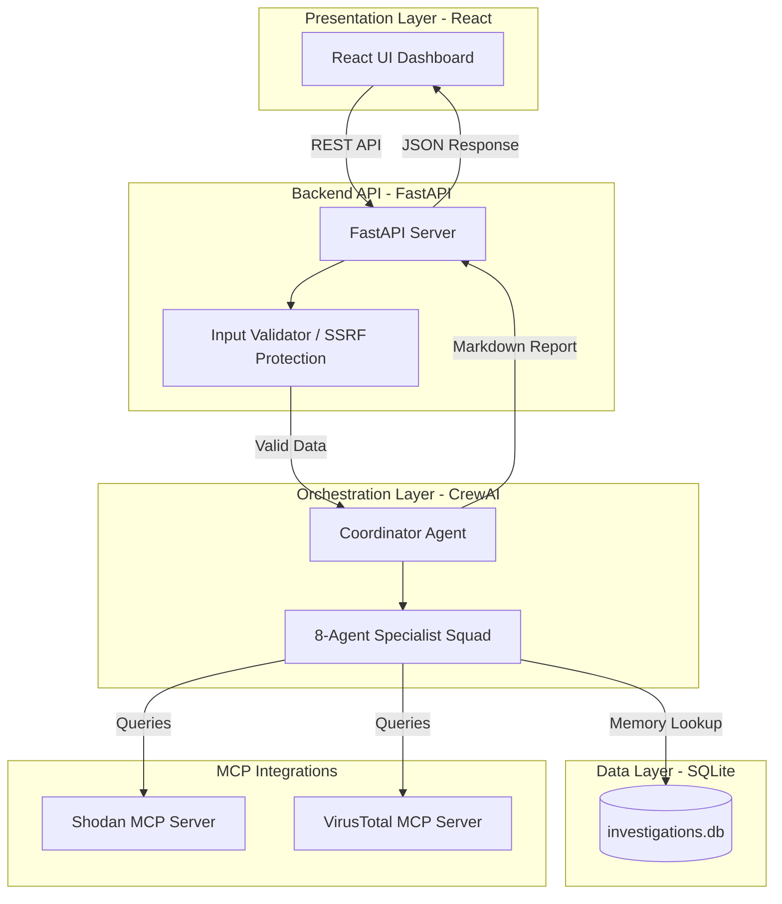

<div align="center">
  
  
  
  
</div>
<br>

<div align="center">
  <h1>🛡️ CyberFusion AI</h1>
  <p><strong>Multi-Agent SOC Threat Intelligence & Incident Response Platform</strong></p>
  <p><i>Scaling Security Operations Centers through autonomous AI orchestration and the Model Context Protocol (MCP).</i></p>
</div>

---

## ⚡ The Problem
Security Operations Center (SOC) analysts are suffering from unprecedented burnout due to "alert fatigue." When a threat is detected, analysts must manually pivot between multiple disconnected tools (e.g., SIEMs, VirusTotal, Shodan, compliance matrices) to investigate. This context-switching process is highly repetitive, taking hours per incident and resulting in delayed response times that give cyber attackers a critical advantage.

## 🚀 The Solution
CyberFusion AI automates the threat triage and intelligence-gathering process using a **decentralized squad of 8 specialized AI agents**. 

You provide a single indicator of compromise (an IP, a firewall log, a URL). Our CrewAI orchestration pipeline dynamically assigns tasks to specialist agents (Recon, Threat, Log, Risk, Compliance, Report, Memory). These agents autonomously query external threat intelligence feeds, calculate CVSS risk scores, map compliance controls, check local SQLite history for recurring attacks, and compile a board-ready Markdown/PDF report—all in seconds.

## 🏗️ Architecture

CyberFusion AI utilizes a highly secure, modular architecture:

- **Frontend**: React + Tailwind CSS (Statically served for maximum deployability). Provides a real-time HUD of the agent thought process.
- **Backend API**: FastAPI (Python). Enforces strict rate-limiting (`slowapi`) and prompt-injection defense.
- **Orchestration**: CrewAI + Langchain. Manages the multi-agent conversational flow.
- **Tool Integration (MCP)**: Implements the **Model Context Protocol (MCP)** to securely spin up Shodan and VirusTotal servers as child processes, granting agents safe access to external APIs.
- **Persistence**: SQLite vector memory for instant historical threat recall.



## 📸 Interface Preview

*(Insert your screenshots of the UI, Agent Pipeline, and Final Report here!)*
- `[Screenshot 1: The Dashboard / Executive Summary]`
- `[Screenshot 2: The Visual Agent Pipeline animating]`

## 🛠️ Instructions for Setup

The platform is designed for rapid deployability. Ensure you have **Python 3.10+** installed.

```bash
# 1. Clone the repo
git clone https://github.com/your-org/cyberfusion-ai.git
cd cyberfusion-ai

# 2. Create and activate a virtual environment
python -m venv venv
# On Windows: venv\Scripts\activate
# On Mac/Linux: source venv/bin/activate

# 3. Install dependencies
pip install -r requirements.txt

# 4. Start the server
python api/main.py
```
Open **[http://localhost:8000](http://localhost:8000)** in your browser. 
*(Note: You can provide your OpenAI API key directly in the UI Settings panel, or via a `.env` file).*

---

## 📚 Hackathon Deliverables

Please explore the `docs/` folder for our comprehensive Hackathon submissions:
- 📝 [Official Hackathon Writeup](docs/hackathon_writeup.md)
- 🎬 [5-Minute Demo Video Script](docs/demo_video_outline.md)
- 🤖 [Agent Specialization Map](docs/agents.md)
- 🔒 [Developer & Security Guide](docs/developer_guide.md)
