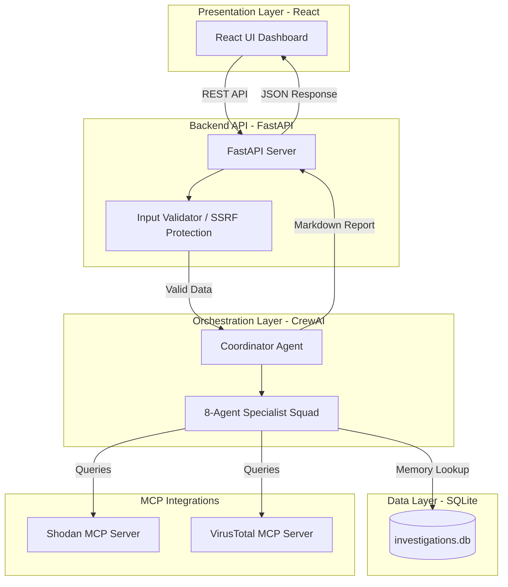

  
  
  
  

 

  <h1>🛡️ CyberFusion AI</h1>
  
<strong>Multi-Agent SOC Threat Intelligence & Incident Response Platform</strong>

  
<i>Scaling Security Operations Centers through autonomous AI orchestration and the Model Context Protocol (MCP).</i>

---

## ⚡ The Problem
Security Operations Center (SOC) analysts are suffering from unprecedented burnout due to "alert fatigue." When a threat is detected, analysts must manually pivot between multiple disconnected tools (e.g., SIEMs, VirusTotal, Shodan, compliance matrices) to investigate. This context-switching process is highly repetitive, taking hours per incident and resulting in delayed response times that give cyber attackers a critical advantage.

## 🚀 The Solution
CyberFusion AI automates the threat triage and intelligence-gathering process using a **decentralized squad of 8 specialized AI agents**. 

You provide a single indicator of compromise (an IP, a firewall log, a URL). Our CrewAI orchestration pipeline dynamically assigns tasks to specialist agents (Recon, Threat, Log, Risk, Compliance, Report, Memory). These agents autonomously query external threat intelligence feeds, calculate CVSS risk scores, map compliance controls, check local SQLite history for recurring attacks, and compile a board-ready Markdown/PDF report—all in seconds.

---

## 🏗️ Categorized Technology Stack

CyberFusion AI utilizes a highly secure, modular architecture separated into distinct layers:

### 🎨 Frontend (User Interface)
- **Framework**: React 19 + Vite (via Babel standalone CDN execution for ultimate portability)
- **Styling**: Tailwind CSS with custom glassmorphism and keyframe animations
- **Icons**: Lucide React
- **Rendering**: Real-time agent streaming HUD, dynamic Markdown rendering, PDF generation

### ⚙️ Backend (API Gateway & Orchestration)
- **API Server**: FastAPI (Python) running on Uvicorn
- **Orchestration**: CrewAI + Langchain (Managing the 8-agent conversational flow)
- **Security**: Strict rate-limiting (`slowapi`), prompt-injection defense, SSRF protection

### 🔌 Data & Verification Layer (Memory & Tools)
- **Persistence**: SQLite (Local Vector-like memory for historical threat recall)
- **Integrations**: **Model Context Protocol (MCP)** for secure tool execution
- **Sandboxed APIs**: Shodan MCP Server & VirusTotal MCP Server

---

## 🗺️ Architecture Flowchart

---

## 🛠️ Getting Started

For a clean and rapid setup, we have separated our documentation:

- 🚀 **[STARTUP.md](STARTUP.md)**: 1-Click quick start guide if your environment is already configured.
- ⚙️ **[README_SETUP.md](README_SETUP.md)**: Comprehensive, step-by-step developer environment setup (Python, venv, `.env` config).

---

## 📚 Hackathon Deliverables

Please explore the `docs/` folder for our comprehensive Hackathon submissions:
- 📝 [Official Hackathon Writeup](docs/hackathon_writeup.md)
- 🎬 [5-Minute Demo Video Script](docs/demo_video_outline.md)
- 🤖 [Agent Specialization Map](docs/agents.md)
- 🔒 [Developer & Security Guide](docs/developer_guide.md)
