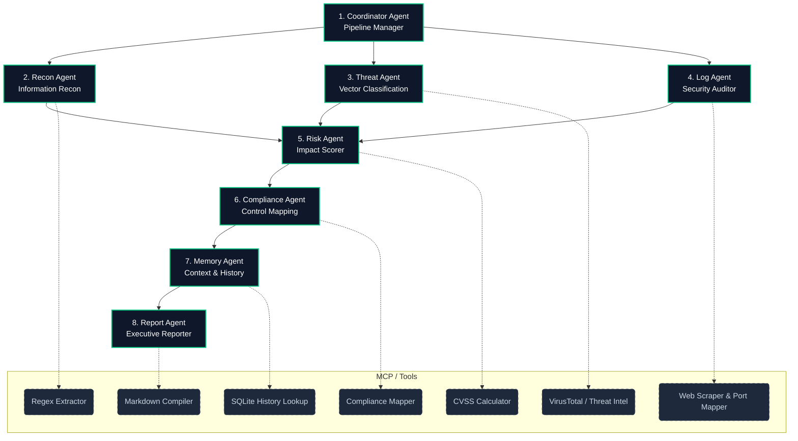

# SOC Agent Specialization Diagram

This diagram maps out the 8 CrewAI specialist agents, their specific roles in the incident response pipeline, and the tools they leverage.

```mermaid
graph TD
    %% Coordinator
    Coord[1. Coordinator Agent<br>Pipeline Manager]

    %% Tier 1
    Recon[2. Recon Agent<br>Information Recon]
    Threat[3. Threat Agent<br>Vector Classification]
    Log[4. Log Agent<br>Security Auditor]
    
    %% Tier 2
    Risk[5. Risk Agent<br>Impact Scorer]
    Comp[6. Compliance Agent<br>Control Mapping]
    Mem[7. Memory Agent<br>Context & History]
    
    %% Output
    Rep[8. Report Agent<br>Executive Reporter]

    %% Flow
    Coord --> Recon
    Coord --> Threat
    Coord --> Log
    
    Recon --> Risk
    Threat --> Risk
    Log --> Risk
    
    Risk --> Comp
    Comp --> Mem
    Mem --> Rep

    %% Tools Mapping
    subgraph Tools [MCP / Tools]
        Regex(Regex Extractor)
        VT(VirusTotal / Threat Intel)
        Scraper(Web Scraper & Port Mapper)
        CVSS(CVSS Calculator)
        Mapper(Compliance Mapper)
        SQLite(SQLite History Lookup)
        MD(Markdown Compiler)
    end

    %% Tool Assignments
    Recon -.-> Regex
    Threat -.-> VT
    Log -.-> Scraper
    Risk -.-> CVSS
    Comp -.-> Mapper
    Mem -.-> SQLite
    Rep -.-> MD

    classDef agent fill:#0f172a,stroke:#05c280,stroke-width:2px,color:#fff;
    classDef tool fill:#1e293b,stroke:#475569,stroke-width:1px,color:#cbd5e1,stroke-dasharray: 5 5;
    
    class Coord,Recon,Threat,Log,Risk,Comp,Mem,Rep agent;
    class Regex,VT,Scraper,CVSS,Mapper,SQLite,MD tool;
```
