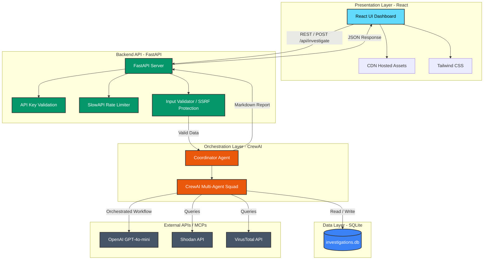

# Architecture Diagram

This diagram illustrates the high-level system architecture of the CyberFusion AI SOC platform, showing the data flow from the React frontend, through the FastAPI backend gateway, to the CrewAI orchestration layer.

