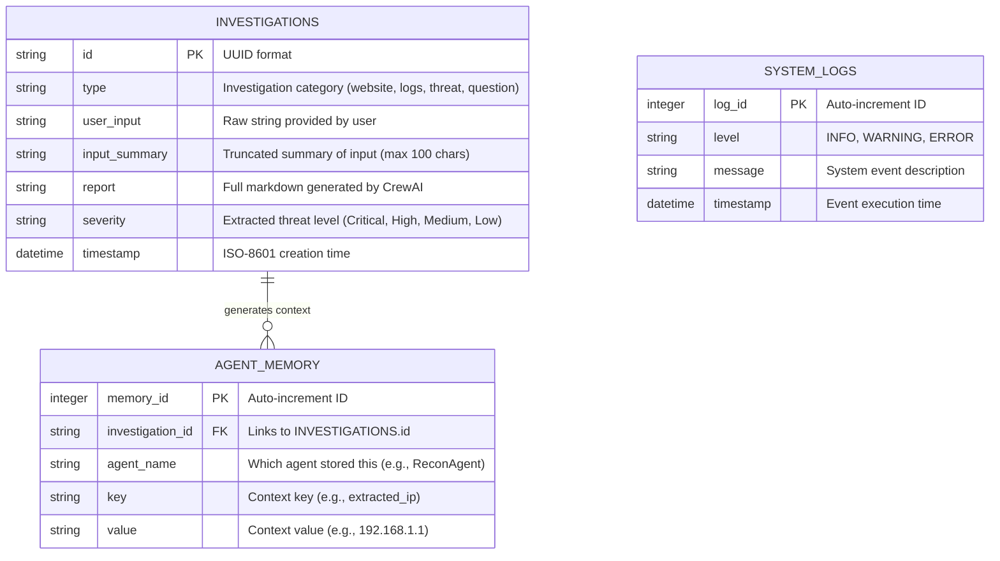

# Database ER Diagram

This entity-relationship diagram maps out the SQLite persistence layer (`investigations.db`), which acts as the memory core for the application, storing reports and linking them to historical queries.

