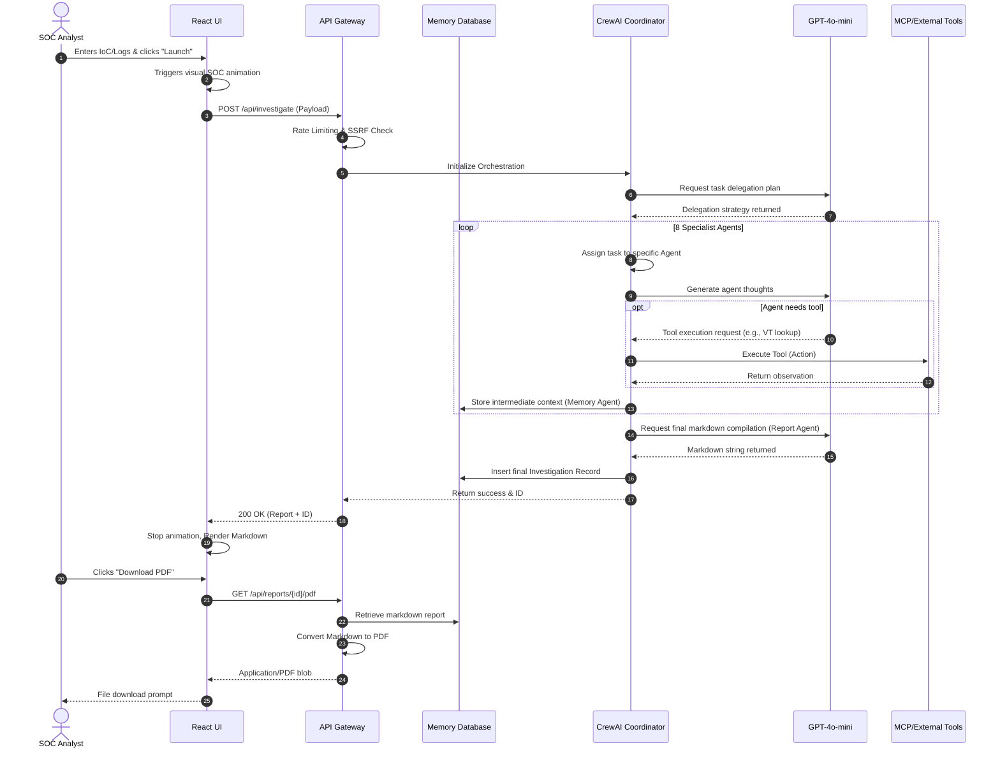

# Investigation Sequence Diagram

This sequence diagram illustrates the flow of a single threat investigation, from the user clicking "Launch" to the final report rendering and PDF generation.

```mermaid
sequenceDiagram
    autonumber
    
    actor User as SOC Analyst
    participant React as React UI
    participant FastAPI as API Gateway
    participant SQLite as Memory Database
    participant Crew as CrewAI Coordinator
    participant OpenAI as GPT-4o-mini
    participant Tools as MCP/External Tools

    User->>React: Enters IoC/Logs & clicks "Launch"
    React->>React: Triggers visual SOC animation
    React->>FastAPI: POST /api/investigate (Payload)
    
    FastAPI->>FastAPI: Rate Limiting & SSRF Check
    FastAPI->>Crew: Initialize Orchestration
    
    Crew->>OpenAI: Request task delegation plan
    OpenAI-->>Crew: Delegation strategy returned
    
    loop 8 Specialist Agents
        Crew->>Crew: Assign task to specific Agent
        Crew->>OpenAI: Generate agent thoughts
        
        opt Agent needs tool
            OpenAI-->>Crew: Tool execution request (e.g., VT lookup)
            Crew->>Tools: Execute Tool (Action)
            Tools-->>Crew: Return observation
        end
        
        Crew->>SQLite: Store intermediate context (Memory Agent)
    end
    
    Crew->>OpenAI: Request final markdown compilation (Report Agent)
    OpenAI-->>Crew: Markdown string returned
    
    Crew->>SQLite: Insert final Investigation Record
    Crew-->>FastAPI: Return success & ID
    
    FastAPI-->>React: 200 OK (Report + ID)
    
    React->>React: Stop animation, Render Markdown
    User->>React: Clicks "Download PDF"
    React->>FastAPI: GET /api/reports/{id}/pdf
    FastAPI->>SQLite: Retrieve markdown report
    FastAPI->>FastAPI: Convert Markdown to PDF
    FastAPI-->>React: Application/PDF blob
    React-->>User: File download prompt
```
