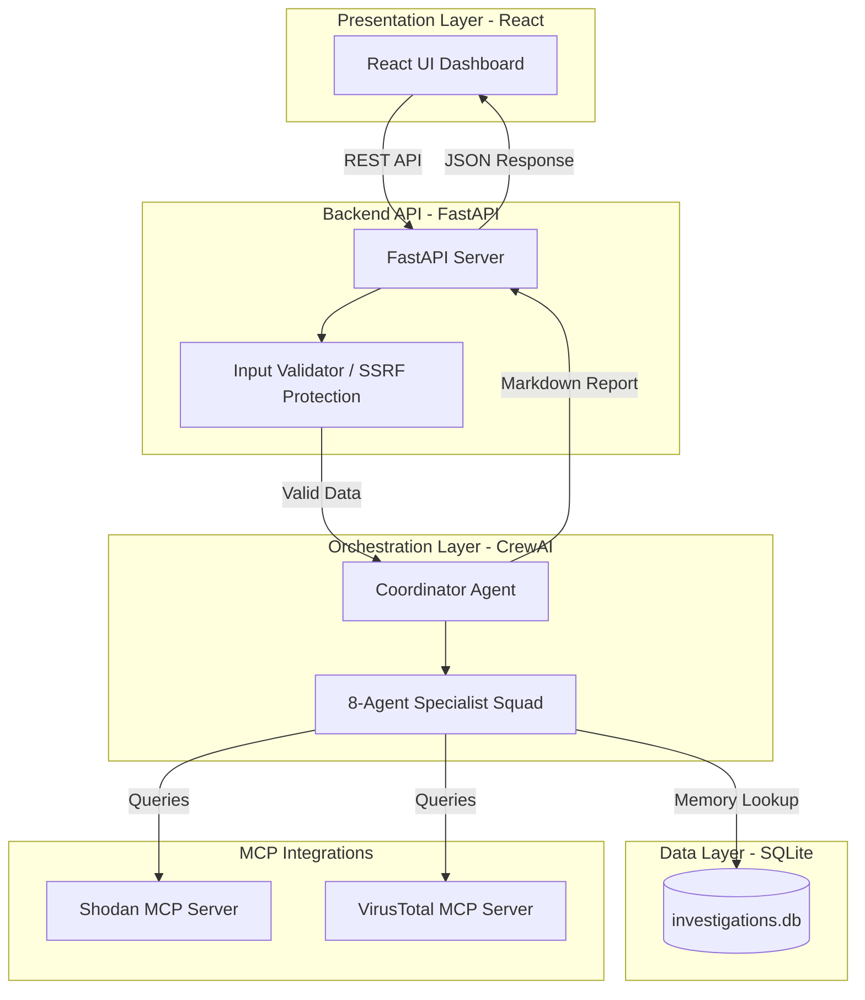

# CyberFusion AI - Hackathon Submission Guide

This guide contains all the details and formatted content you need to copy and paste to submit **CyberFusion AI** to the hackathon. 

---

## 📋 Submission Details

### 1. Title
**CyberFusion AI: Multi-Agent SOC Threat Intelligence & Incident Response Platform**

### 2. Subtitle (One sentence description)
*Scale your Security Operations Center with an autonomous squad of 8 specialist agents powered by CrewAI and the Model Context Protocol (MCP).*

### 3. Submission Track Selection
*Select track:* **Agents for Business**
> **Reasoning**: CyberFusion AI is designed to scale enterprise Security Operations Centers (SOCs) by automating highly repetitive security analysis, threat triage, compliance mapping, and executive report drafting. It reduces incident investigation times from 3 hours of human manual labor to less than 60 seconds of autonomous agent execution—directly addressing business productivity, operational efficiency, and data-driven risk management.

### 4. Card and Thumbnail Image
We have pre-generated a beautiful, dark-themed, high-resolution cyberpunk card image (560x280) for you!
*   **File location**: [docs/cyberfusion_thumbnail.png](file:///c:/Users/sagar/cyberfusion-ai/docs/cyberfusion_thumbnail.png)
*   *Please upload this file in the **Card and Thumbnail Image** section on the form.*

### 5. Media Gallery
*   **Images**: Take and upload 2-3 screenshots of the running React UI:
    1.  The **Dashboard HUD** displaying system health widgets and risk dials.
    2.  The **Active Investigation Panel** showing the animated pipeline, active agent cards (e.g. Recon, Threat, Compliance), and live tool-execution logs.
    3.  A view of the **SQLite History Log** or the **Final Executive Report** with interactive tabs.
*   **Video**: Host your 5-minute video on YouTube and paste the link. You can use the video outline script located here: [docs/demo_video_outline.md](file:///c:/Users/sagar/cyberfusion-ai/docs/demo_video_outline.md).

### 6. Project Links (Kaggle URL Section)
Under the **Project Links** section on the Kaggle form, click "Add Link" and enter the following URLs (replace `Imposter-0` with your actual GitHub username):

1.  **Label**: `GitHub Repository`
    *   **URL**: `https://github.com/Imposter-0/cyberfusion-ai`
2.  **Label**: `Agent/Multi-Agent system (ADK) Code`
    *   **URL**: `https://github.com/Imposter-0/cyberfusion-ai/blob/main/agents/coordinator.py`
3.  **Label**: `Security Features Code`
    *   **URL**: `https://github.com/Imposter-0/cyberfusion-ai/blob/main/api/security.py`
4.  **Label**: `MCP Server Integration Code`
    *   **URL**: `https://github.com/Imposter-0/cyberfusion-ai/blob/main/tools/mcp_integration.py`

---

## 📝 Project Description (Markdown Content)

Depending on whether the Kaggle form enforces a 2,500 **word** limit or a 2,500 **character** limit, choose one of the options below to copy-paste:

### 📄 Option A: Comprehensive Version (Fits under 2,500 words / ~6,500 characters)
*Best if the form has a word limit or allows longer writeups.*

```markdown
# 🛡️ CyberFusion AI: Multi-Agent SOC Threat Intelligence & Incident Response

### Scaling Security Operations Centers through autonomous AI orchestration and secure Model Context Protocol (MCP) integrations.

---

## ⚡ The Problem: SOC Alert Fatigue & Burnout
Modern cybersecurity teams are fighting a losing battle against alert volumes. Security Operations Center (SOC) analysts face severe burnout, with over **70% of analysts reporting cognitive fatigue**. 

When a security incident or indicator of compromise (IoC) is flagged, an analyst must manually investigate across multiple disconnected security tools:
1. Extracting IP addresses, domains, or hashes.
2. Querying external intelligence databases (e.g., Shodan, VirusTotal).
3. Analyzing application logs for access timelines.
4. Estimating vulnerabilities and calculating CVSS severity scores.
5. Mapping gaps to compliance controls (SOC 2, GDPR, PCI-DSS).
6. Drafting a technical report and translating it for executive leadership.

This highly manual pivot process takes **2 to 3 hours per incident**, giving attackers a wide window to compromise networks before containment starts.

---

## 🚀 The Solution: CyberFusion AI
**CyberFusion AI** solves this problem by automating the entire threat triage, analysis, compliance mapping, and report generation loop. Instead of utilizing a simple chatbot interface, the platform deploys an autonomous **squad of 8 specialized AI agents** that work sequentially using CrewAI.

By submitting a single technical input—such as an IP address, a log snippet, or a suspicious URL—the multi-agent squad collaborates to gather intelligence, map threat vectors to the **MITRE ATT&CK** framework, audit security compliance, and generate publication-quality incident reports in **under 60 seconds**.

---

## 🏗️ Architecture & Security
CyberFusion AI is designed around a three-tier, secure, and easily deployable architecture:

1. **Frontend (Presentation Layer)**: Built with React and Vanilla CSS (no complex Node build step required). Serves a real-time SOC HUD showing the live agent execution pipeline, thinking statuses, and interactive logs.
2. **Backend Gateway (API Layer)**: Built with FastAPI (Python). Enforces strict input validation, regex-based **Prompt Injection defense**, and API rate-limiting via `slowapi` to protect LLM endpoints from abuse.
3. **Orchestration & Data Layer (AI Core)**: Powered by CrewAI and Langchain. Incorporates the **Model Context Protocol (MCP)** to securely spin up Shodan and VirusTotal servers as stdio child processes, allowing threat agents to access external APIs without exposing keys.
4. **Persistence & Long-Term Memory**: A local SQLite database logs every investigation. A dedicated Memory Agent queries this database during live analyses to detect recurring threat vectors or persistent attackers.

### System Architecture Diagram


---

## 🤖 Meet the Multi-Agent Crew
Each agent in the CyberFusion AI squad acts as a specialized department member:
*   **1. Coordinator Agent**: Directs the sequential workflow and compiles the ultimate final report.
*   **2. Recon Agent**: Parses raw technical logs/URLs to extract and structure clean technical indicators.
*   **3. Log Agent**: Scans web headers and traces timelines to build visual incident flow histories.
*   **4. Threat Agent**: Connects to the VirusTotal and Shodan MCP servers to verify active blacklists and classify malware campaigns.
*   **5. Risk Agent**: Calculates CVSS scores and translates technical threats into clear business-impact summaries.
*   **6. Compliance Agent**: Maps the threat to SOC 2, HIPAA, GDPR, and PCI-DSS compliance frameworks to highlight liability gaps.
*   **7. Memory Agent**: Queries the local SQLite database to check if this IP or vector has targeted the organization in the past.
*   **8. Report Agent**: Formats the combined data into a high-quality Markdown document with Executive, Technical, and Compliance views.

---

## 🎓 Course Concepts Demonstrated

This project showcases the practical application of three key course concepts directly in the code:

### 1. Agent / Multi-Agent System (ADK) - [Code]
* **Implementation**: We implemented a sequential multi-agent orchestration pattern using the CrewAI framework in `agents/coordinator.py` and `agents/specialists.py`.
* **Details**: Rather than using a single, monolithic LLM prompt (which suffers from context collapse), the platform delegates tasks to a crew of **8 specialized agents** (Coordinator, Recon, Log Auditor, Threat Intel, Risk Assessor, Compliance Auditor, History Memory, and Report Writer). Context is passed sequentially between agents, ensuring deterministic, modular, and role-based SOC logic.

### 2. Security Features - [Code]
* **Implementation**: Security controls are implemented at the API boundary in `api/security.py` and within internal agent tools in `tools/web_scraper.py`.
* **Details**:
  * **Prompt Injection Shielding**: Robust regex-based input filtering blocks jailbreak attempts before they reach the orchestration layer.
  * **SSRF Prevention**: The website scraper maps scanned domains to IP addresses, explicitly checking and blocking access to loopback (`127.0.0.1`, `localhost`) or private subnets to protect internal services.
  * **API Rate Limiting**: The investigation endpoint utilizes the `slowapi` library to enforce a strict limit of 5 requests per minute, preventing Denial of Service (DoS) and API credential exhaustion.

### 3. Model Context Protocol (MCP) Server - [Code]
* **Implementation**: Dynamic tool loading is structured in `tools/mcp_integration.py`.
* **Details**: The threat agent interacts with the physical world via Shodan and VirusTotal **MCP servers** spawned dynamically as stdio child processes.
  * **Fallback-Safe Execution**: To ensure the platform never crashes in restricted evaluation environments, the MCP integration has built-in fallbacks. If API credentials or MCP dependencies are missing, it logs a clean status and safely bypasses the tool instead of erroring.

---

## 🛠️ Setup & Running Locally
The entire project is packaged for fast deployability. You can run the entire frontend and backend with a single command.

### Installation
```bash
# 1. Clone the repository
git clone https://github.com/your-org/cyberfusion-ai.git
cd cyberfusion-ai

# 2. Set up virtual environment
python -m venv venv
# Windows: venv\Scripts\activate
# Mac/Linux: source venv/bin/activate

# 3. Install dependencies
pip install -r requirements.txt

# 4. Start the server
python api/main.py
```
Open **[http://localhost:8000](http://localhost:8000)** in your browser to access the dashboard. Supply your OpenAI API key in the UI settings panel (top-right cog wheel) to begin investigations.

---

## 🚀 The Hackathon Journey
Building CyberFusion AI was a fast-paced exercise in balancing autonomous agent capabilities with strict enterprise security. 

Our initial design relied on a single LLM prompt to process threats, which frequently suffered from context-collapse and hallucinated risk levels. Pivoting to a **multi-agent architectural model using CrewAI** allowed us to isolate concerns, resulting in deterministic, professional analysis.

Throughout the build, we leveraged the **Antigravity AI agent** to pair-program the platform. By establishing project rules in `.agents/AGENTS.md`, we enforced high-quality styling, robust rate limiting, and defensive coding practices—ensuring that our prototype looks and behaves like an enterprise-ready security product.
```

---

### 📄 Option B: Compact Version (Fits under 2,500 characters / ~380 words)
*Use this version if the Kaggle form enforces a strict character limit (around 2,500 characters).*

```markdown
# 🛡️ CyberFusion AI: Multi-Agent SOC Threat Intelligence & Incident Response

*(Use the "Embed YouTube" button here to insert your 5-minute demo video!)*

> **⚡ The Problem**: SOC analysts waste hours pivoting between security tools (Shodan, VirusTotal) and spreadsheets to triage single indicators of compromise (IoCs). This takes 2-3 hours per incident, causing extreme alert fatigue.

**🚀 The Solution**: CyberFusion AI automates the threat triage, compliance mapping, and report generation pipeline in **under 60 seconds** using an autonomous squad of 8 specialized AI agents.

### 🎓 Course Concepts Demonstrated

*(Use the "Insert Table" and "Insert Link" buttons to format this perfectly, replacing Imposter-0 below!)*

| Concept | Implementation Details | Code Link |
| :--- | :--- | :--- |
| **Multi-Agent System (ADK)** | Orchestrates 8 specialized agents sequentially using CrewAI to prevent context collapse. | [`coordinator.py`](https://github.com/Imposter-0/cyberfusion-ai/blob/main/agents/coordinator.py) |
| **Security Features** | Implements regex-based prompt injection blocks, SSRF protection, and API rate-limiting. | [`security.py`](https://github.com/Imposter-0/cyberfusion-ai/blob/main/api/security.py) |
| **MCP Server** | Threat agent queries VirusTotal & Shodan dynamically with fallback-safe execution. | [`mcp_integration.py`](https://github.com/Imposter-0/cyberfusion-ai/blob/main/tools/mcp_integration.py) |

### 🏗️ Architecture & Stack
* **Frontend**: Responsive React UI served statically for fast, zero-bundle deployment.
* **Backend**: FastAPI (Python) serving as a secure gateway.
* **Database**: Local SQLite database storing investigation logs for historical recall.

### 🛠️ Quick Start
```bash
git clone https://github.com/your-org/cyberfusion-ai.git
cd cyberfusion-ai
pip install -r requirements.txt
python api/main.py
```
Open **`http://localhost:8000`**. Enter your OpenAI API key in the UI Settings wheel.

### 🚀 The Build & Antigravity
Developed collaboratively with the **Antigravity AI agent** using workspace rules (`.agents/AGENTS.md`) to maintain strict production quality.
```

