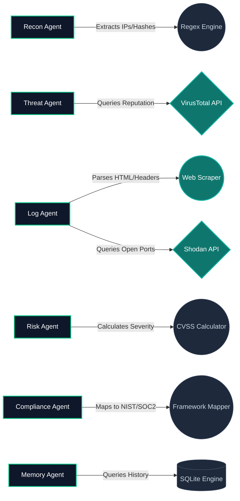

# Tool Flow Diagram

This diagram maps how external APIs, tools, and the Model Context Protocol (MCP) integrate with specific CrewAI specialist agents.

```mermaid
graph LR
    %% Agents
    Recon[Recon Agent]
    Threat[Threat Agent]
    Log[Log Agent]
    Risk[Risk Agent]
    Comp[Compliance Agent]
    Mem[Memory Agent]

    %% Internal Tools
    Regex((Regex Engine))
    CVSS((CVSS Calculator))
    Map((Framework Mapper))
    SQL[(SQLite Engine)]

    %% External Tools
    Scrape((Web Scraper))
    Shodan{Shodan API}
    VT{VirusTotal API}

    %% Relationships
    Recon -- Extracts IPs/Hashes --> Regex
    Log -- Parses HTML/Headers --> Scrape
    Risk -- Calculates Severity --> CVSS
    Comp -- Maps to NIST/SOC2 --> Map
    Mem -- Queries History --> SQL

    %% External MCP integrations
    Threat -- Queries Reputation --> VT
    Log -- Queries Open Ports --> Shodan

    %% Styling
    classDef agent fill:#0f172a,stroke:#05c280,stroke-width:2px,color:#fff;
    classDef internal fill:#1e293b,stroke:#475569,stroke-width:1px,color:#cbd5e1;
    classDef external fill:#0f766e,stroke:#14b8a6,stroke-width:2px,color:#fff;

    class Recon,Threat,Log,Risk,Comp,Mem agent;
    class Regex,CVSS,Map,SQL internal;
    class Scrape,Shodan,VT external;
```
